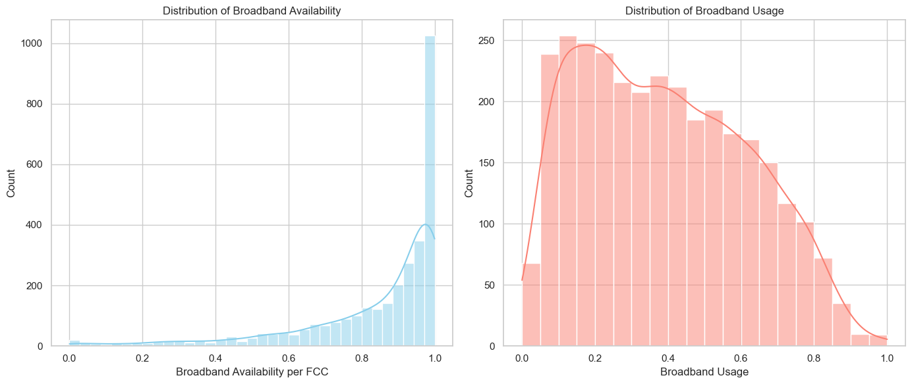
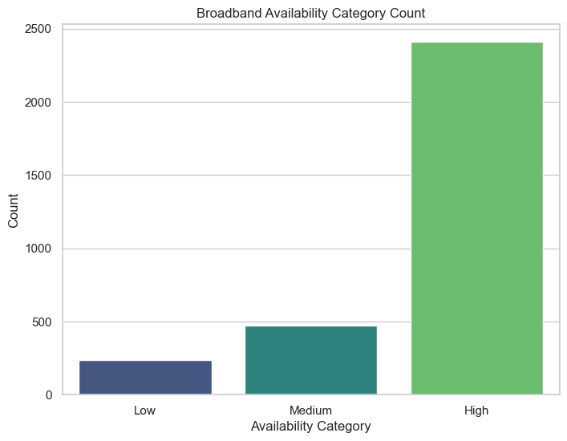
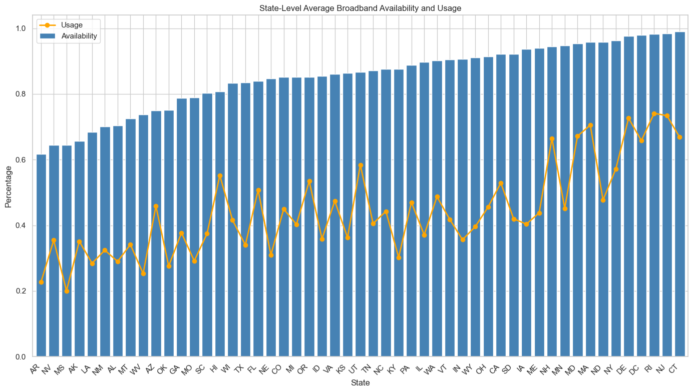
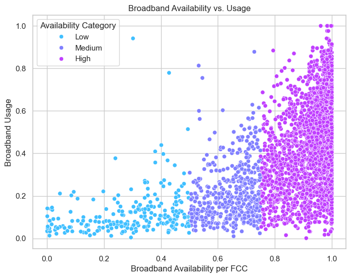

# United States Broadband Availability - Availability Classification for October 2020
## Project Description
This project aims to analyze the availability and usage of broadband internet across U.S. counties as of October 2020. By exploring broadband distribution patterns and modeling classification based on availability, we gain insights into regional connectivity disparities and identify areas with limited access. The project leverages machine learning techniques to classify broadband availability into high, medium, and low categories based on data from the Federal Communications Commission (FCC).

## Dataset Description
The dataset, sourced from the FCC, provides county-level broadband metrics, including the percentage of broadband availability and usage per county across the United States. Each record includes identifiers like county and state names, making it suitable for both regional analysis and aggregate modeling. Key fields include broadband availability, broadband usage, county identifiers, and state identifiers.

## Summary of Findings
The analysis indicates that broadband availability and usage vary significantly across counties and states. Areas with low broadband availability correlate with lower usage rates, highlighting access challenges. High broadband availability predominantly exists in urbanized regions, while rural counties often fall into medium or low availability categories. The Random Forest model proved to be the most accurate (100%) in classifying availability, underscoring its suitability for this classification task.

## Data Preprocessing
Cleaning Column Names: Removing extra spaces for consistent referencing.
Data Type Conversion: Converting availability and usage fields from string to numeric formats.
Handling Missing Values: Dropping rows with missing values in critical columns.
Feature Engineering: Creating availability categories (high, medium, low) based on predefined thresholds and calculating state-level average availability and usage for comparative insights.

## Exploratory Data Analysis
Histogram of Broadband Availability and Usage: Shows the distribution of availability and usage rates across counties.
Availability Category Counts: Displays the count of counties within each availability category (high, medium, low).
State-Level Averages: A bar and line plot compares average broadband availability and usage by state, highlighting regional differences.
Availability vs. Usage Scatter Plot: Demonstrates the correlation between broadband availability and usage across counties.
## Visualization

## "This chart illustrates the broadband usage and broadband availability between the different counties."

## "This chart categorizes the broadband availability category count."

## "This chart shows the average broadband availability and usage in each state."

## "This illustration shows the relationship between the broadband availability and usage."

## Model Development
For classification, we explored several machine learning models:

Logistic Regression
Random Forest
Support Vector Machine (SVM)
K-Nearest Neighbors (KNN)

## Model Evaluation
The models were evaluated on their accuracy and classification metrics. The Random Forest model achieved perfect accuracy, making it the best classifier for broadband availability, followed closely by Logistic Regression with 99% accuracy. SVM and KNN models also performed well, achieving accuracies of 97% and 95%, respectively.

## Conclusion
This project highlights broadband accessibility trends across U.S. counties, identifying disparities in rural and urban regions. The Random Forest model’s accuracy validates its effectiveness in classifying broadband availability, aiding in identifying areas that may benefit from increased connectivity efforts. These insights provide a valuable resource for policymakers focusing on bridging the digital divide.
## Contributors
❗ NOTE: Your professor be the one to fill this section.
